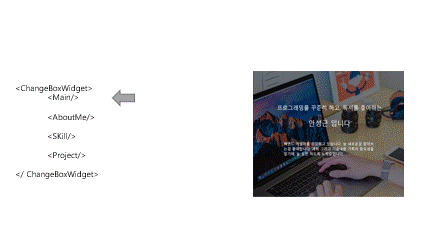
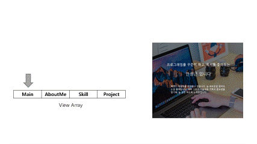

# portFolioV2

# 🌐포트폴리오 웹페이지

---

- create-react-app이 아닌 esbulid을 이용해 제작한 reactjs 프로젝트이며, 저에 대한 소개를 하기 위해 만든 정적 웹페이지 입니다.
- [https://devsanso.github.io/portFolioV2/](https://devsanso.github.io/portFolioV2/)

# 특징

---

- 사용자한테 직접 보여줄 컴포넌트를 배열 형식으로 메모리 할당후 특정 이벤트에 따라 랜더링 하는 기능





# 사용한 프레임워크 + 언어 + 개발 도구

---

- reactjs(프론트엔드 프레임워크)
- nodejs + npm(번들링 도구 런타입)
- typescript(언어)
- esbuild(번들링 도구)

# 빌드

---

```bash
npm install
npm run build # 프로젝트의 docs 폴더로 번들링된 파일들이 저장된다.
#npm run http : 빌드된 결과물을 서버로 보고싶을경우 => 127.0.0.1:8080 접속
```